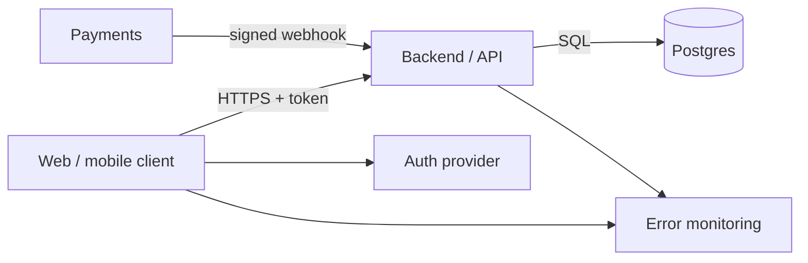
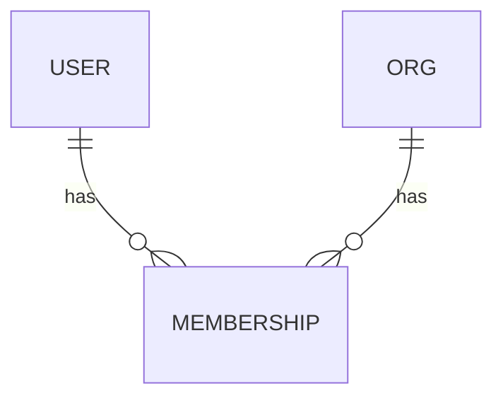

# 03 · Architecture, Data Model & Permissions

Status: {{draft | approved by <name> on <date>}}

## Stack
Preset(s): {{e.g. python + expo-react-native}} (see stack-presets/)

| Concern | Choice | ADR (if non-default) |
|---|---|---|
| Platforms | {{web / iOS / Android}} | |
| Client / UI framework | {{e.g. Next.js, Expo, Flutter, SwiftUI}} | |
| Backend / API | {{framework, or BaaS}} | |
| DB | Postgres on {{provider}}, region {{region}} | |
| ORM / migrations | {{tool}} | |
| Auth | {{managed provider}} | |
| Hosting / distribution | {{host; app stores + internal testing}} | |
| Errors / logs | {{Sentry / Crashlytics + structured logs}} | |
| Other services | {{payments, email, storage, push}} | |

## System diagram

## Data model
| Entity | Key fields | Owner / tenant column | Personal data? | Retention | Notes |
|---|---|---|---|---|---|
| user | id, email, name | — | yes | until account deletion | managed by auth provider |
| {{entity}} | | `org_id` | | | |

Indexes and constraints:
-

## Roles
| Role | Description |
|---|---|
| anonymous | not signed in |
| member | |
| owner | |
| admin | internal staff; all actions audited |

## Permission matrix (default: DENY). Source of truth for `src/server/authz` tests.
| Resource · action | anonymous | member | owner | admin |
|---|---|---|---|---|
| project · read (own org) | ✗ | ✓ | ✓ | ✓ |
| project · create | ✗ | ✓ | ✓ | ✗ |
| project · delete | ✗ | ✗ | ✓ | ✓ (audited) |
| any · access other org | ✗ | ✗ | ✗ | ✓ (audited) |

## Secrets & config
Anything shipped to a browser or phone is public. Secrets exist only on the server and in secret stores.

| Name | Used by | Public? | Stored in | Rotation |
|---|---|---|---|---|
| DATABASE_URL | server | no | host secret store | on incident |
| SENTRY_DSN | client + server | yes | build config | — |
| Signing key / certificate (mobile) | CI / build service | no | build service secrets | per store rules |

## Client data & offline (mobile / SPA)
| Data | Cached on device? | Storage | Expiry | Offline behavior |
|---|---|---|---|---|

## External APIs
| Service | Purpose | Auth method | Rate limits | Failure behavior |
|---|---|---|---|---|

## Top risks
1.
