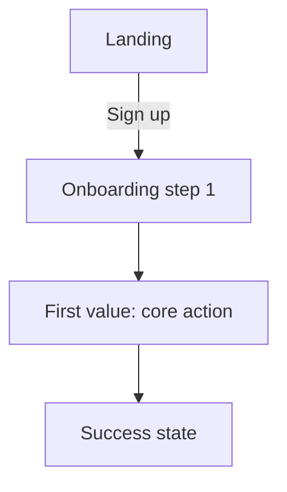

# 04 · UX Flow

Steps to first value: {{n}} (target from SC-2: ≤ 3)

## Entry points
| Entry | Who | Lands on | Goal |
|---|---|---|---|
| First visit | new user | | |
| Returning | member | | |
| Invite link | invited user | | |
| Admin | staff | | |

## Core flow

## Screens
### {{Screen name}}
- **Purpose:** 
- **Why it's here (criterion):** SC-
- **Primary action (one):** 
- **Secondary actions:** 
- **Data shown:** 
- **States:**
  - Empty:
  - Loading:
  - Error:
  - No permission:
- **Copy notes:** 

<!-- Repeat per screen -->
